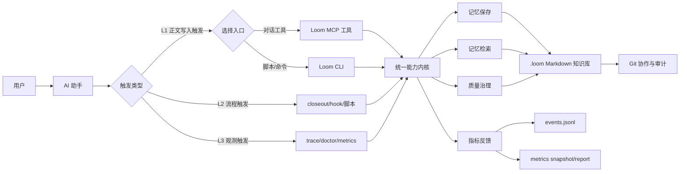
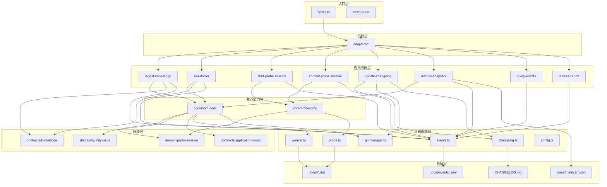
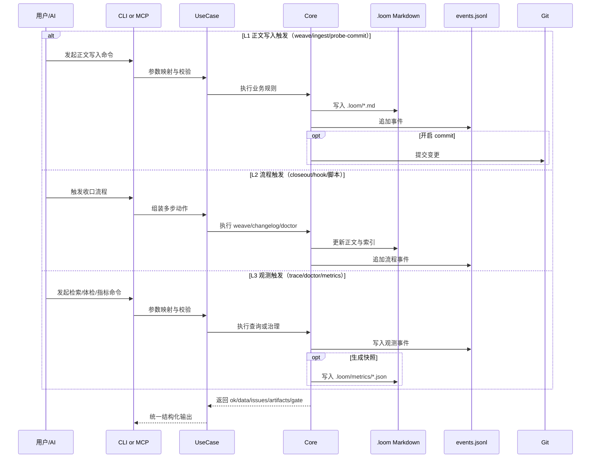
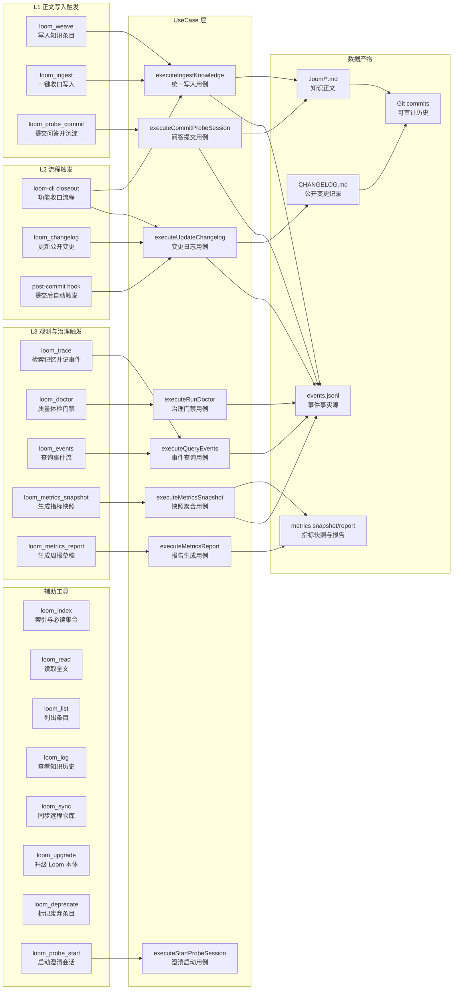

# Loom 技术架构图（全局总览）

本文给两层视图：

- 第一层：给非技术同学的“业务总览图”（先看整体怎么运转）
- 第二层：给技术同学的“工程细化图”（再看模块边界和数据流）

---

## 01. 业务总览图（非技术优先）

### 这张图怎么理解

- Loom 不依赖单一入口：聊天里可用 MCP，自动化里可用 CLI。
- 触发分三层：L1（正文写入）、L2（流程收口）、L3（观测记录）。
- 不管从哪里进，都会走同一个能力内核，保证行为一致。
- 记忆落在本地 Markdown（`.loom`），不是黑盒数据库。
- Git 提供版本历史与团队协作；事件与指标提供可量化反馈。

---

## 02. 工程细化图（技术实现）

---

## 03. 记忆触发时序（关键路径）

### 触发层定义（补充说明）

- **L1 正文写入触发**：把知识正文落到 `.loom/*.md`（核心记忆）。
- **L2 流程触发**：把“人记得做”变成“流程保证做”（closeout、hook、CI 脚本）。
- **L3 观测触发**：不一定写正文，但会记录事件/快照用于治理与复盘。

---

## 04. 架构硬核点（简版）

- **双入口同核**：CLI 与 MCP 共享同一用例/核心能力，避免逻辑分叉。
- **可审计记忆**：Markdown + Git，天然支持 review、diff、回滚。
- **可治理闭环**：doctor + events + metrics snapshot/report，支持持续优化。
- **可扩展演进**：当前已具备 domain/usecase/contracts 分层，可平滑扩到 HTTP/Daemon。

---

## 05. Tool 能力映射图（从工具看架构）

### 一句话看懂这张图

- 工具不是孤立能力：每个 tool 都映射到统一 usecase，再统一沉淀到 Markdown/事件/指标/Git 产物。
