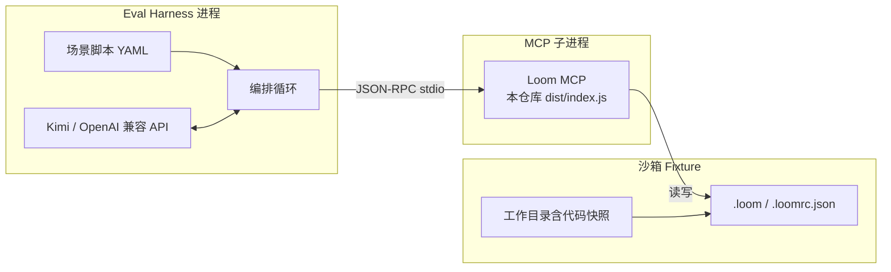

# 01：提示词沙箱 + LLM 对话评测 Harness（落地执行计划）

| 字段        | 值                                                                                                                                                                                                   |
| --------- | --------------------------------------------------------------------------------------------------------------------------------------------------------------------------------------------------- |
| 状态        | 草案（待实施）                                                                                                                                                                                             |
| 创建        | 2026-03-18                                                                                                                                                                                          |
| 负责人 / 协作方 | （可选，尚未指定）                                                                                                                                                                                           |
| 关联文档      | [`执行计划/00-meta-plan-writing-convention.md`](./00-meta-plan-writing-convention.md)（**结构约定，本文遵循之**）、[`执行计划/03-opencode-context-request-logging.md`](./03-opencode-context-request-logging.md)（OpenCode 内请求落盘，可与 Harness 并行）、[`待整理/PROMPTS.md`](../待整理/PROMPTS.md)、[`待整理/CURSOR_HINTS.md`](../待整理/CURSOR_HINTS.md)、[`待整理/TEST_SET.md`](../待整理/TEST_SET.md)、[`待整理/METRIC_EVENT_MAPPING.md`](../待整理/METRIC_EVENT_MAPPING.md)、[`待整理/ARCHITECTURE.md`](../待整理/ARCHITECTURE.md)、[`待整理/ROADMAP.md`](../待整理/ROADMAP.md) |

**约定**：章节划分与必填模块对齐 `00` 的 §4.1–§4.10；文件命名符合 `00` §2（本文件为 `01-…`）。

**在仓库文档体系中的位置**：本 plan 是专题落地拆解；长期方向见 [`待整理/ROADMAP.md`](../待整理/ROADMAP.md)，任务总表可与 [`待整理/IMPLEMENTATION_PLAN.md`](../待整理/IMPLEMENTATION_PLAN.md) 互链；提示词与 MCP 行为背景见 [`待整理/PROMPTS.md`](../待整理/PROMPTS.md)、`.loom/decisions/mcp-and-cli-prompt-sources-kept-separate.md`。

***

## 1. 背景与动机（为何现在写这个 plan）

### 1.1 产品 / 技术上下文

Loom 同时提供 **MCP**（对话中由模型调工具写读 `.loom/`）与 **CLI**（人/脚本显式执行）。影响「模型是否按预期使用 Loom」的文案集中在 `prompts/<locale>/<version>/`（工具说明、`loom-instructions` 等），可通过 `promptVersion` / 环境变量切换版本做对比（见 [`待整理/PROMPTS.md`](../待整理/PROMPTS.md)）。

### 1.2 已暴露的问题或机会

1. **宿主行为与 MCP 不同步**\
   在 Cursor 等环境里，即使已接入 Loom MCP，Agent 仍可能优先使用内置「写文件」能力直接改 `.loom/**/*.md`，从而绕过 lint、`index.md` 重建、Git 提交、事件流等。产品侧已通过提示词与 `docs/CURSOR_HINTS.md` 引导「优先 `loom_weave`」，但**是否生效依赖真实多轮对话验证**，而非仅靠代码单测。

2. **提示词优化缺少可重复实验台**\
   修改 `loom-instructions.md` 或 `tools/*.md` 后，若仅在人工聊天里主观感受，难以：

   * 固定条件对比 **v1 / v2**；

   * 统计「是否调用 `loom_index` / `loom_weave`」等**行为指标**；

   * 留存完整**原始轨迹**供复盘。

3. **「全量数据」诉求**\
   希望在一个**隔离环境**里模拟「真实代码库 + 用户使用 Loom」的效果，并在实验后**系统性地收集** `.loom` 下各类产物（如 `events.jsonl`、`raw_conversations/`、`index.md`、Git 历史等），用于分析提示词与工具编排的因果，而不是依赖单次 IDE 会话的碎片观察。

### 1.3 本 plan 要解决的一句话

**构建可脚本化的「沙箱工作目录 + MCP stdio 子进程 + 可选真实 LLM（如 Kimi）多轮对话」评测链路**，使提示词迭代与场景回归**可重复、可对比、可归档**，并尽量接近真实用户路径。

### 1.5 宿主怎么跑（说人话）

* **不模拟 Cursor**。你本机已经**全局装了 OpenCode CLI**，评测时就让 **OpenCode 当「壳」**：它去连模型、加载 MCP（其中一个是 Loom）。

* **Loom MCP 用哪份程序？** 见下面 **§5 的 Q2（已拍板）**：统一用**当前这个 Loom 仓库**里 `npm run build` 出来的 `node dist/index.js`，这样测的就是你正在改的这份代码；不会稀里糊涂用到别处装的老版本 `loom`。

### 1.4 边界（非目标，刻意不做）

* 不替代现有 **Vitest 单元/用例测试**（仍负责确定性逻辑回归）。

* 不在首版要求 **100% 确定** 的模型行为（接受一定随机性，用低温、固定台词、多次运行与统计缓解）。

* 不把 **API Key** 写入仓库（仅环境变量/CI Secret）。

***

## 2. 目标与非目标

### 2.1 目标

| ID | 目标            | 说明                                                                                               |
| -- | ------------- | ------------------------------------------------------------------------------------------------ |
| G1 | **隔离沙箱**      | 固定 `LOOM_WORK_DIR` 指向专用目录，实验可 wipe 重建，不污染开发者本机主项目。                                               |
| G2 | **MCP 真链路**   | 通过 **stdio** 启动与本仓库一致的 `loom` MCP 服务，工具列表从服务端**动态获取**（避免 Harness 与产品 schema 漂移）。                 |
| G3 | **可选 LLM 驱动** | 支持接入用户自备 Key（如 Kimi 2.5）；协议优先 **OpenAI 兼容**（`/v1/chat/completions` + tools），降低适配成本。              |
| G4 | **场景即数据**     | 用户台词、system 补充、运行参数（如 `LOOM_PROMPT_VERSION`）用**版本化文件**（如 YAML/JSON）描述，便于 PR 审查与复跑。               |
| G5 | **采集清单化**     | 每次 run 结束生成**报告目录**（或归档包）：约定路径下的日志、`.loom` 树摘要、可选 `git log`，并有一份 **manifest** 说明本 run 的配置与场景 ID。 |

### 2.2 非目标（首版可不实现；与 §1.4 互补，偏交付范围）

* 在 CI 中默认跑「花钱的」LLM 场景（可作为 **manual / nightly** 工作流）。

* 模拟 Cursor 界面或 Agent 编排；首版以 **OpenCode CLI**（你本机已装）作为真实宿主即可。

* 自动给提示词打分（可留作二期：用规则或二次 LLM 评判）。

***

## 3. 方案概要

### 3.1 架构与数据流

**职责划分：**

* **Fixture**：看起来像「小真实项目」的目录树 + 初始化好的 `.loom`（或场景第一步调用 `loom_init`）。

* **MCP**：`LOOM_WORK_DIR=<fixture>` 启动，使用当前构建的 `node dist/index.js` 或 `loom` 命令。

* **Harness**：

  1. 连接 MCP，拉取 `tools/list`；
  2. 将工具定义映射为 LLM 的 `tools`/`function` 格式；
  3. 多轮：user/assistant/tool\_result；
  4. 结束后按「采集清单」拷贝/汇总产物。

### 3.2 关键决策与取舍（摘要）

* **stdio MCP 子进程**：与 Cursor 真实接入方式一致，避免首版自建 HTTP MCP 网关。

* **工具定义从 MCP 动态拉取**：避免 Harness 内手写工具 schema 与 `src/index.ts` 漂移。

* **场景文件与代码分离**：YAML/JSON 场景可审阅、可版本管理，符合 `00` §4.2 对可验收目标的期望。

* 更细的产品层决策（如 MCP 与 CLI 文案是否同源）见 `.loom/decisions/`，本 plan 不重复展开。

### 3.3 仓库内挂载点（规划）

| 路径                                 | 用途                                   |
| ---------------------------------- | ------------------------------------ |
| `eval/harness/`（或 `scripts/eval/`） | Harness 源码与入口脚本                      |
| `eval/fixtures/*`                  | 沙箱工作目录模板 / 最小「像真项目」快照                |
| `eval/runs/`                       | 单次评测产出（gitignore，仅存本地或 CI artifact）  |
| `eval/README.md`                   | 环境变量、命令、与 `00` §4.8 验收对齐的「15 分钟跑通」说明 |

***

## 4. 落地执行计划

### 阶段 0：目录与约定（0.5～1 天）

**依赖**：无。\
**交付**：后续阶段可引用的目录与文档约定。

* [ ] 在仓库内新增 `eval/harness/`（或 `scripts/eval/`）占位，**不提交**任何 Secret。

* [ ] 新增 `eval/fixtures/minimal-repo/`：最小 `README` + 可选几份假源码 + `.loomrc.json` 模板（可按需 `loom_init` 生成）。

* [ ] 在本文档或 `eval/README.md` 中写明：环境变量表（`LOOM_WORK_DIR`、`LOOM_PROMPT_VERSION`、`KIMI_API_KEY` / `OPENAI_API_KEY`、Base URL 等）。

* [ ] `.gitignore`：忽略 `eval/runs/**`、本地 `.env`、沙箱内 `node_modules`（若有）。

### 阶段 1：无 LLM 冒烟（1～2 天）

**依赖**：阶段 0（目录、`eval` 占位、文档中启动方式约定）。\
**目的**：验证「子进程 MCP + 沙箱目录」管道正确，不依赖模型与费用。

* [ ] 使用 `@modelcontextprotocol/sdk` **Client** + **StdioClientTransport** 连接 `loom`。

* [ ] 调用 `tools/list`，断言存在 `loom_weave`、`loom_index` 等关键工具。

* [ ] 调用 `loom_weave` 写入一条 `decisions` 测试条目，断言文件出现在 `.loom/decisions/`。

* [ ] 可选：调用 `loom_list` 或读 `events.jsonl` 做最小断言。

* [ ] 将该冒烟纳入 `npm run test` 或单独 `npm run eval:smoke`（CI 友好、无 Key）。

### 阶段 2：场景文件与采集清单（1～2 天）

**依赖**：阶段 1（MCP 冒烟通过，fixture 路径可用）。

* [ ] 定义场景 schema（建议 JSON Schema 或 TypeScript 类型）：`id`、`turns[]`（`role` + `content`）、`env` 覆盖、`expect`（可选：期望调用的工具名列表——仅作软断言/统计）。

* [ ] 实现 run 结束后的 **artifact collector**：
  * 复制或列出 `.loom/events.jsonl`、`.loom/raw_conversations/`（若开启）、`.loom/index.md`；

  * 记录 `git status` / `git log -1`（若 fixture 为 git 仓库）；

  * 写 `run-manifest.json`（时间戳、场景 ID、环境变量快照（脱敏）、prompt 版本）。

* [ ] 与 `docs/TEST_SET.md` / `docs/eval/test-set.json` 对齐命名，避免两套概念长期分裂（可引用或渐进合并）。

### 阶段 3：接入 Kimi（或任意 OpenAI 兼容端点）（2～4 天）

**依赖**：阶段 2（场景格式与 artifact collector 雏形）；**P0 澄清项 Q1** 结论会约束本阶段实现形态。（**Q2 已拍板**：Loom MCP 子进程用本仓库 `node dist/index.js`。）

* [ ] 抽象 `LlmClient` 接口：`chat({ messages, tools }) -> { message, tool_calls? }`。

* [ ] 实现 OpenAI 兼容适配器（Kimi 若兼容则零改或仅改 baseUrl）。

* [ ] 实现主循环：**assistant 带 tool\_calls → 调 MCP** **`tools/call`** **→ 将结果以** **`tool`** **消息塞回 → 直到无 tool\_calls 或达轮次上限**。

* [ ] 支持 `temperature: 0`、可选 `seed`（若 API 支持）。

* [ ] 文档：如何本地 `export KIMI_API_KEY` 后运行 `npm run eval:scenario -- --file ...`。

### 阶段 4：提示词 A/B 与报告（持续）

**依赖**：阶段 3（LLM 闭环可跑通）；可选依赖 `prompts/zh/v2/`（见 §5 Q4）。

* [ ] 同一场景连续跑两次：仅改 `LOOM_PROMPT_VERSION=v1` / `v2`（需提前准备 `prompts/zh/v2/` 或在计划中登记创建方式）。

* [ ] 输出对比表（脚本或手工模板）：工具调用次数、是否写入 `decisions`、响应延迟、token 用量（若 API 返回）。

* [ ] 将典型 run 的 `run-manifest.json` + 脱敏后的 transcript 作为附录存入 `eval/runs/samples/`（**勿含 key 与隐私**）。

***

## 5. 待与用户澄清的问题与建议

写法与「风险」区别见 [`执行计划/00-meta-plan-writing-convention.md`](./00-meta-plan-writing-convention.md) §4.5；澄清结论落地后应记入 **§10 修订记录** 或 `.loom/decisions/`，并回改本表（删除或标记已解决）。

**优先级档位（与** **`00`** **一致）**

| 档位           | 含义                |
| ------------ | ----------------- |
| **P0 / 阻塞**  | 不澄清可能无法开工或推翻主技术路线 |
| **P1 / 高影响** | 可开工但易大幅返工或验收争议    |
| **P2 / 中低**  | 可按默认假设推进，后续可改     |

| ID | 优先级     | 问题 / 待澄清点                                                                    | 若不澄清会影响什么                               | 建议（可选）                                                                                                                                   |
| -- | ------- | ---------------------------------------------------------------------------- | --------------------------------------- | ---------------------------------------------------------------------------------------------------------------------------------------- |
| Q1 | P0      | **Kimi 2.5（或目标模型）是否采用 OpenAI 兼容 Chat Completions + tools？** Base URL、鉴权头字段名？ | Harness 阶段 3 的 `LlmClient` 实现方式可能整段返工   | 先查官方文档；若不兼容则单独适配器 + 集成测                                                                                                                  |
| Q2 | **已拍板** | **启动 Loom MCP 时用啥命令？** 以前写得太绕，白话是：用终端里打的 `loom`，还是用「当前仓库里编译出来的那个文件」？         | 若混用，会出现「我本地跑的是 A 版本，CI 跑的是 B 版本」，结果对不上。 | **统一规定**：自动评测一律 `npm run build` 后 **`node dist/index.js`**（stdio MCP）。你日常全局装的 `loom` 只管自己用，**不算**这条评测链路的默认入口。CI 与本地同一套，避免「我机器能过、CI 过不了」。 |
| Q3 | P1      | **Fixture 仓库是否必须初始化为 Git？**（便于断言 `git log`）                                  | 阶段 2 采集清单里 Git 相关项是否纳入验收                | 最小 fixture 用 `git init` 空提交；无 Git 场景标为非目标                                                                                                |
| Q4 | P2      | **v2 提示词目录**由谁在何时创建：与 Harness 同步还是提前手工复制？                                    | 仅影响阶段 4 启动顺序，不阻塞阶段 0–3                  | 首版可仅用 `v1` 跑通 A/B 文档，v2 后续补                                                                                                              |

***

## 6. 数据、安全与合规

* **Key**：仅进程环境变量；日志中过滤 `Authorization` 与常见 key 字段。

* **沙箱**：默认使用无真实用户数据的合成仓库；若用脱敏真实项目快照，需合规审查后再入库。

* **原始对话**：若开启 Loom `fullConversationLogging`，报告需说明存储路径与 redact 行为（与产品配置一致）。

***

## 7. 风险与缓解

| 风险                          | 缓解                                |
| --------------------------- | --------------------------------- |
| 模型不遵循工具调用格式                 | 低温、明确 system、固定用户台词；失败时重试 N 次并记录。 |
| MCP schema 与某厂商 tools 格式不兼容 | 保留一层 `mcpToolToLlmTool()` 映射单测。   |
| 成本与限流                       | 默认 CI 只跑阶段 1；LLM 场景本地或 nightly。   |
| 维护负担                        | 场景文件小而多、Harness 薄；复杂逻辑仍在 Loom 主包。 |

***

## 8. 验收标准

（本 plan「完成」的最低定义，便于关单 / 归档。）

1. 文档：`eval/README.md`（或等价）可让新同学在 **15 分钟内** 跑通 **无 LLM 冒烟**。
2. 一条 **示例场景** + 一次 **LLM 驱动**（可选 Key）跑通并生成 `run-manifest.json` + 约定产物目录。
3. 同一场景 **两次不同** **`LOOM_PROMPT_VERSION`** 的命令行 invocation 有文档记录，且产物可区分归档。

***

## 9. 后续演进（不在首版范围，可建档跟踪）

* 工具调用「硬断言」与软指标（调用率）分层统计。

* 与 `docs/METRICS.md` 中的事件类型对齐自动化校验。

* 多模型横评（同一沙箱、同场景、不同 endpoint）。

* 可选：轻量 Web UI 查看 `eval/runs/` 报告。

***

## 10. 修订记录

| 日期         | 修订内容                                                                                                                    |
| ---------- | ----------------------------------------------------------------------------------------------------------------------- |
| 2026-03-18 | 初稿：背景、架构、分阶段任务、验收与风险。                                                                                                   |
| 2026-03-18 | 新增 §5「待与用户澄清的问题与建议」（对齐 `00` §4.5）；原 §5–9 顺延为 §6–10。                                                                     |
| 2026-03-18 | 按 `00` 全文对齐：文首约定与元信息、`1.4`/`2.2` 边界表述、`3` 方案概要（取舍 + 挂载点）、`4` 各阶段**依赖**、`5` 优先级参照表与澄清闭环说明、`6`/`8` 标题与 `00` §4.6/§4.8 一致。 |
| 2026-03-20 | 白话化 **Q2** 并**拍板**（评测统一 `node dist/index.js`）；新增 **§1.5**（OpenCode CLI 作宿主、不模拟 Cursor）；`2.2` / Mermaid 与阶段 3 依赖表述同步。    |
