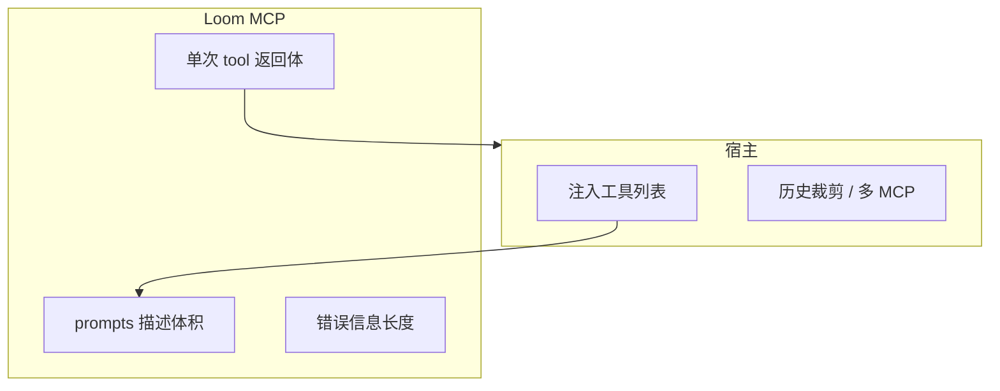

# 02：MCP 上下文占用与读路径有界化（执行计划）

| 字段 | 值 |
|------|-----|
| 状态 | **阶段 0–1 已落地**（读路径默认有界 + 配置/env；阶段 2/3 仍可选） |
| 创建 | 2026-03-20 |
| 负责人 / 协作方 | （可选，尚未指定） |
| 关联文档 | [`执行计划/00-meta-plan-writing-convention.md`](./00-meta-plan-writing-convention.md)（**本文遵循之，含 §5 Task / §6 TDD**）、[`计划草稿/02-mcp-context-pollution-and-token-cost.md`](../计划草稿/02-mcp-context-pollution-and-token-cost.md)（主题同源草稿）、[`调研/上下文工程-核心观点与对Loom的启发.md`](../调研/上下文工程-核心观点与对Loom的启发.md)、[`待整理/PROMPTS.md`](../待整理/PROMPTS.md)、[`执行计划/01-prompt-sandbox-llm-eval-harness.md`](./01-prompt-sandbox-llm-eval-harness.md)、[`执行计划/03-opencode-context-request-logging.md`](./03-opencode-context-request-logging.md)（宿主侧请求可观测） |

**约定**：章节划分对齐 `00` 的 §4.1–§4.10；文件名为 **`02-…`**（与 `01-` 递增编号一致）。

**与计划草稿关系**：[`计划草稿/02`](../计划草稿/02-mcp-context-pollution-and-token-cost.md) 阐述问题与意向；**本文件**为可勾选、可验收的**执行拆解**；阶段内 **Task 表** 对齐 `00` §5（含 TDD / DoD）。

---

## 1. 背景与动机（为何现在写这个 plan）

### 1.1 产品 / 技术上下文

Loom 通过 MCP 暴露多条工具与 `loom-instructions`。宿主会把 **工具 schema + 描述** 注入模型上下文，每次 **tool 返回** 也会进入后续轮次。参阅 [Harness/ACI 调研](../调研/上下文工程-核心观点与对Loom的启发.md)：**上下文不是无限内存**；大块返回会挤压「正常对话」并增加 **Token 成本**。用户反馈「MCP 容易污染对话」在 **Loom 侧可改进空间**主要在于：**单次返回体大小**、**默认值**、**提示词篇幅**；宿主侧策略（多 MCP、历史压缩）由集成方负责，但需在文档中**划界**。

### 1.2 已暴露的问题或机会

1. **工具面**：连接后模型长期携带 **全部工具** 的 description + 参数说明，总 token 与工具数量近似线性相关。  
2. **结果面**：`loom_list` 等若枚举大量条目、`loom_trace` 在宽 `limit` 下，可能单次撑满窗口。当前实现中已有局部截断（如 `loom_index` 内 `SNIPPET_LIMIT`、`truncateText`），但 **缺少统一契约与文档化默认上界**。  
3. **观测缺口**：难以从仓库内数据回答「哪类 tool 返回最常过大」，不利于迭代。  
4. **与 01 的衔接**：评测 harness 跑通后，可对 **有界策略** 做 A/B（同场景对比返回字节与轮次）。

### 1.3 本 plan 要解决的一句话

**把「读路径默认有界 + 责任边界写清 +（可选）轻量观测与精简提示词」落到代码与文档，在不大破 MCP 契约的前提下降低无效上下文与 Token。**

### 1.4 边界（非目标，刻意不做）

* 不实现各宿主的「按需子集工具」或上下文压缩算法。  
* 不为省 token 删除 **必要** 参数说明导致误调用率上升（可接受 **lite 文案** 在独立版本目录中维护）。  
* 首版不强制 **减少工具数量**（与产品完整性冲突时以可选 profile 形式出现）。

---

## 2. 目标与非目标

### 2.1 目标

| ID | 目标 | 验收指向 |
|----|------|----------|
| G1 | **读路径默认有界** | 主要读类工具在默认参数下有 **文档化** 条数/字符策略；过大时 **明确提示** 如何收窄或 `loom_read` |
| G2 | **配置化上限** | `.loomrc` 或 env（如 `LOOM_MCP_*`）可覆盖默认上限，便于开发/评测 |
| G3 | **文档划界** | `待整理/PROMPTS.md` 或 README 有 **Loom vs 宿主** 的 Token/上下文说明 |
| G4 | **（可选）返回体档位观测** | 事件或日志中有 **tool 名 + 返回字节档位**（不全文落事件，除非 debug） |
| G5 | **（可选）prompt lite** | `prompts/` 第二套 **更短** 工具说明，由 `promptVersion` 或 manifest 选用 |

### 2.2 非目标

* 替代 `fullConversationLogging` 的设计目标（磁盘全量 ≠ 进模型上下文）。  
* 保证任意宿主下总 Token 下降 X%（依赖宿主行为）。  
* 一次 PR 内做完所有工具的「完美最优」上限（分阶段合并）。

---

## 3. 方案概要

### 3.1 责任分层

### 3.2 代码挂载点（实施时从这里改）

| 区域 | 路径 | 备注 |
|------|------|------|
| MCP 工具注册与 handler | `src/index.ts` | `loom_index` / `loom_trace` / `loom_list` / `loom_read` 等返回值组装 |
| 检索与摘要 | `src/weaver.ts`（及 trace 实现） | `limit`、snippet 长度 |
| 配置 | `src/config.ts` | 新增可选字段或 env 读取 |
| 提示词 | `prompts/zh/v1/`（及未来 `v1-lite`） | `prompt-loader.ts` 已支持版本目录 |

### 3.3 关键取舍

* **默认偏小**：与 `loom-instructions` 中渐进披露一致；需要全量时显式调大 `limit` 或 `loom_read`。  
* **可观测优于猜测**：先 G4 再调参，避免拍脑袋上限。  
* **CLI 与 MCP 同内核**：若调整默认上限，评估 CLI 是否共用常量，避免两套行为（见 [`待整理/ROADMAP.md`](../待整理/ROADMAP.md) P1）。

---

## 4. 落地执行计划

> **质量门禁**（`00` §6）：除纯文档 Task 外，须 **先/同 PR 带测试**；**DoD** 含 `npm test` 相关用例通过。

### 阶段 0：盘点与文档（约 0.5～1 天）

**依赖**：无。

| Task ID | 目标 | 涉及路径 | 依赖 | TDD / 测试 | DoD |
|---------|------|----------|------|------------|-----|
| **T0.1** | 各 MCP 工具读类/上限/代码位置一览表 | `src/index.ts`、`src/weaver.ts`（梳理即可） | 无 | **无行为变更，豁免单测**；**附录 A** 为本 Task 落地载体，后续代码变更时同步改附录 | 附录 A 与代码一致 |
| **T0.2** | PROMPTS 增加「上下文与 Token：分层责任」 | [`待整理/PROMPTS.md`](../待整理/PROMPTS.md) | T0.1 可选 | 无行为变更豁免 | 文档段落可引用 |
| **T0.3** | （可选）抽样 prompts 字符量 | `prompts/zh/v1/tools/*.md` | 无 | 豁免 | 脚本输出或笔记进 PR |

- [x] T0.1 完成盘点表并与代码一致（**附录 A** 已预填基线，改 `trace`/`list`/`index` 等后须同步修订）。  
- [x] T0.2 合并 **宿主 vs Loom** 责任说明（见 [`待整理/PROMPTS.md`](../待整理/PROMPTS.md) §3.1）。  
- [ ] T0.3 可选。

### 阶段 1：统一有界策略与配置（约 2～4 天）

**依赖**：阶段 0。

| Task ID | 目标 | 涉及路径 | 依赖 | TDD / 测试 | DoD |
|---------|------|----------|------|------------|-----|
| **T1.1** | 集中默认上限常量 + config/env 覆盖 | `src/config.ts`，可选 `src/mcp-limits.ts`（新建） | T0.1 | **新增** `tests/mcp-bounded-reads.test.ts`（或扩展现有 usecase/adapter 测）：断言默认 `list`/`trace` 行为边界 | `npm test` 绿 |
| **T1.2** | `loom_list` 有界 + 截断提示文案 | `src/index.ts` | T1.1 | 同上文件：多 fixture 条目时返回含「已截断/共 N 条」类提示 | 单测覆盖大列表 fixture |
| **T1.3** | `loom_trace` 默认 limit 与 schema 描述一致 | `src/index.ts`、`prompts/zh/v1/tools/loom_trace.md` | T1.1 | `adapter-consistency` 或专用测：CLI/MCP 同路径一致 | 测绿 + 文档一致 |
| **T1.4** | 共用上限与 CLI 行为对齐说明 | `src/cli.ts`（若需读同一常量） | T1.1–T1.3 | `tests/adapter-consistency.test.ts` 仍通过 | 无回归 |

**Fixture**：在 `tests/fixtures/` 或测试内 `mkdtemp` 生成 **多条目 `.loom`**（阶段 1 必备，随 PR 入仓）。

- [x] T1.1–T1.4 按上表勾选（配置：`src/config.ts`；边界函数：`src/mcp-read-bounds.ts`；MCP：`src/index.ts`；CLI：`src/cli.ts`；测：`tests/mcp-bounded-reads.test.ts`）。

### 阶段 2：观测（可选，约 1～2 天）

**依赖**：阶段 1。

| Task ID | 目标 | 涉及路径 | 依赖 | TDD / 测试 | DoD |
|---------|------|----------|------|------------|-----|
| **T2.1** | tool 返回字节档位写入 events（无正文） | `src/events.ts`、`src/index.ts`（包装层） | T1.x | `tests/events-and-report.test.ts` 或新建：模拟一次 tool 调用后事件字段 | 测绿；默认不含 payload 全文 |
| **T2.2** | 与 01 harness manifest 字段对齐 | `docs/执行计划/01-…`、eval 脚本（若有） | T2.1 | 文档或契约测约定字段名 | 01 文档无矛盾 |

**日志**（`00` §8）：若增加 info 级日志，使用前缀 `[loom:mcp]`；禁止默认打印完整 tool 输出。

- [ ] T2.1、T2.2 可选完成。

### 阶段 3：Prompt lite（可选，约 2～3 天）

**依赖**：阶段 0；可与阶段 1 并行。

| Task ID | 目标 | 涉及路径 | 依赖 | TDD / 测试 | DoD |
|---------|------|----------|------|------------|-----|
| **T3.1** | 新增 `prompts/zh/v1-lite/` 或 manifest 登记 | `prompts/`、`prompts/manifest.json` | 无 | `tests/` 中 `loadPromptBundle` 能加载 lite 且关键工具 description 非空 | 测绿 |
| **T3.2** | README 一行说明高 MCP 场景可切 lite | `README.md` | T3.1 | 无行为豁免 | 可读 |

- [ ] T3.1、T3.2 可选。

### 附录 A：MCP 工具盘点（T0.1 基线，与代码同步维护）

> 快照依据：`src/index.ts` 注册顺序 + `src/weaver.ts` 中 `trace` / `listAll` 等。**改默认 limit 或返回格式时请更新本表。**

| 工具 | 主类型 | 返回体量 / 默认有界 | 主要代码位置 | 上下文风险（相对） |
|------|--------|---------------------|--------------|-------------------|
| `loom_init` | 写 / 初始化 | 短文本 | `src/index.ts` | 低 |
| `loom_weave` | 写 | 短文本 + lint 信息 | `src/index.ts` → ingest | 低 |
| `loom_ingest` | 写 | 短文本 | `src/index.ts` | 低 |
| `loom_doctor` | 读 | `maxFindings` 默认 20 | `src/index.ts` | 中 |
| `loom_trace` | 读 | **layered**（默认）与 **legacy** 均在未传 `limit` 时使用 **`mcpReadLimits.traceDefaultLimit`（默认 10）**；MCP 入口用 `resolveTraceLimit` 与 `.loomrc` / `LOOM_MCP_TRACE_DEFAULT_LIMIT` 对齐。每条结果含 `snippet`（`extractSnippet` 局部窗口，约数百字符级） | `src/index.ts`、`src/config.ts`、`src/weaver.ts`（`trace` / `traceLegacy` / `traceLayered`） | **中～高**：legacy 仍会读全库文件累计 `contextChars`（结果条数已有界，但扫描成本仍高） |
| `loom_index` | 读 | **必读区**：最近 `5` 条 + core 概念摘要，单条摘要 `truncateText(..., 220)`；**`### Full Index`** 经 `truncateMarkdownForContext`，默认 **`indexFullMaxChars`（16000）**，超长附截断说明 | `src/index.ts`、`src/mcp-read-bounds.ts`、`src/config.ts`、`rebuildIndex` | **中**：极大库时必读区仍线性增长，但 Full Index 正文已字符有界 |
| `loom_probe_start` | 读 / 会话 | 问题列表，条数受 `max_questions`（默认 3，上限 5） | `src/index.ts` | 中 |
| `loom_probe_commit` | 写 | 短文本 | `src/index.ts` | 低 |
| `loom_probe` | 读+写（兼容） | 同 start/commit 组合 | `src/index.ts` | 中 |
| `loom_read` | 读 | **整篇条目 Markdown，无截断**（设计如此） | `src/index.ts`、`weaver.readKnowledge` | **高**（单条可极大；依赖模型按需调用） |
| `loom_list` | 读 | 先 `listAll` 再 **`applyListEntryCap`**：按 `updated` 新近优先，默认最多 **`listMaxEntries`（100）**，按类分组展示；截断时返回 **共 N 条 / 本次 M 条** 提示 | `src/index.ts`、`src/mcp-read-bounds.ts`、`src/config.ts`、`weaver.listAll` | **中** |
| `loom_sync` | 副作用 | 短文本 | `src/index.ts` | 低 |
| `loom_log` | 读 | `limit` **默认 10** | `src/index.ts`、`GitManager` | 中 |
| `loom_changelog` | 写 | 短文本汇总 | `src/index.ts` | 低 |
| `loom_metrics_snapshot` | 读 | JSON，`max_findings` 等默认有界 | `src/index.ts` | 中～高（视 snapshot 大小） |
| `loom_metrics_report` | 读 | Markdown 报告 | `src/index.ts` | 中 |
| `loom_events` | 读 | `limit` **默认 50** | `src/index.ts` | 中 |
| `loom_upgrade` | 副作用 | 短文本列表 | `src/index.ts` | 低 |
| `loom_deprecate` | 写 | 短文本 | `src/index.ts` | 低 |
| `loom_reflect` | 读 | `maxFindings` 默认 20 | `src/index.ts` | 中 |

**阶段 1 优先动刀（与本附录一致）**：`loom_list`、`loom_trace`（legacy 默认 unlimited）、`loom_index`（Full Index 无界）。`loom_read` 保持「全量」语义，靠提示词与前置 `trace` 控制调用频率。

**另：工具列表侧污染**（连接 MCP 即注入的 schema + description）不在上表，由 **G5 / 阶段 3 prompt lite** 与宿主配置共同缓解。

---

## 5. 待与用户澄清的问题与建议

写法与「风险」区别见 [`执行计划/00`](./00-meta-plan-writing-convention.md) §4.5。

| ID | 优先级 | 问题 / 待澄清点 | 若不澄清会影响什么 | 建议（可选） |
|----|--------|-------------------|--------------------|--------------|
| Q1 | P1 | **`loom_list` 默认展示条数**上限取多少？是否按 category 分页？ | 合并后仍可能一次过大或过度截断遭诟病 | **已决**：全局 **按更新时间排序 + 总 cap**（默认 **100**），见 `mcpReadLimits.listMaxEntries`；不按类分页首版 |
| Q2 | P2 | **观测**进 `events` 是否接受体积增长？是否仅 `debug`？ | 事件文件膨胀 vs 可分析性 | 默认档位枚举 + 采样率 env |
| Q3 | P2 | **lite** 与 **v2 提示词实验** 是否合并为同一目录策略？ | 目录爆炸 | lite 独立 version；v2 仍用于 A/B 文案而非仅缩短 |

---

## 6. 数据、安全与合规

* 事件中的长度统计不得默认包含 **用户密钥或未脱敏 payload**。  
* 若记录 snippet hash 用于去重，需说明目的与保留期。

---

## 7. 风险与缓解

| 风险 | 缓解 |
|------|------|
| 截断导致模型多轮 `read`、总 token 反升 | 返回中明确下一步；监控（阶段 2）验证 |
| 与 CLI 行为不一致 | 共用配置模块；adapter 测试覆盖 MCP/CLI |
| lite 提示词误用率上升 | 契约测试 + 与 v1 对比冒烟 |

---

## 8. 验收标准

1. **阶段 1 完成**：至少 **`loom_list` 与 `loom_trace`**（或本节书面豁免理由）具备 **有界默认行为** + **用户可见提示**。  
2. **G3**：[`待整理/PROMPTS.md`](../待整理/PROMPTS.md)（或 README）存在 **责任分层** 段落。  
3. **测试**：`npm test` 通过，且存在针对 **默认有界** 的自动化断言（见 T1.x）。  
4. （可选）阶段 2/3 完成则补充事件字段或 `v1-lite` 目录与文档。

---

## 9. 后续演进

* MCP **Resources** 承载静态索引、压缩 **tools 列表** 描述重复——依赖协议与宿主。  
* 与分层索引（[`待整理/IMPLEMENTATION_PLAN.md`](../待整理/IMPLEMENTATION_PLAN.md) 索引专项）结合：`trace` 默认走更轻 digest。

---

## 10. 修订记录

| 日期 | 说明 |
|------|------|
| 2026-03-20 | 初稿：执行阶段、挂载点、验收与澄清；承接计划草稿 02。 |
| 2026-03-21 | **编号修正**：全文由误写的「03」改为 **「02」**；对齐 `00` **§5–§9**：阶段 0–3 增加 **Task 表**（ID、路径、TDD、DoD、fixture）；关联 `00` §6 TDD 门禁；计划草稿回链改为 `执行计划/02`。 |
| 2026-03-21 | **附录 A**：落地 T0.1——按当前 `src/index.ts` / `weaver.ts` 填写 MCP 工具盘点、默认 limit、高风险项与阶段 1 优先级。 |
| 2026-03-18 | **阶段 1 落地**：`mcpReadLimits` + env；`loom_list` / `loom_trace`（含 legacy）默认有界；`loom_index` Full Index 字符截断；CLI 与 MCP 共用配置；`tests/mcp-bounded-reads.test.ts`；附录 A 与 `PROMPTS.md` §3.1 同步。 |
