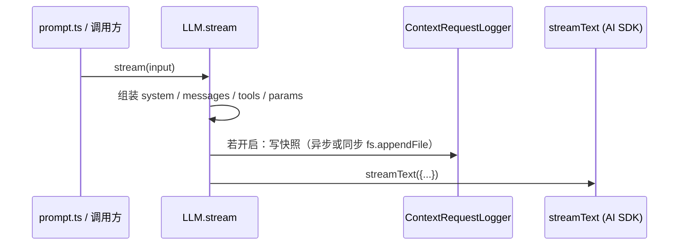

# 03：OpenCode 侧「模型请求上下文」可观测性（执行计划）

| 字段 | 值 |
|------|-----|
| 状态 | **已完成（OpenCode 本机 fork + Loom 文档/E2E）** |
| 创建 / 最近更新 | 2026-03-21 |
| 本机验收通过 | 2026-03-21 |
| 负责人 / 协作方 | （可选）Loom 产品与 OpenCode 本机 fork 维护者 |
| 关联文档 | [`执行计划/00-meta-plan-writing-convention.md`](./00-meta-plan-writing-convention.md)（**本文遵循之**）、[`技术文档/大模型视角-上下文与可观测性.md`](../技术文档/大模型视角-上下文与可观测性.md) §7.5、[`技术文档/OpenCode-Loom-MCP-演练沙箱.md`](../技术文档/OpenCode-Loom-MCP-演练沙箱.md)、[`tests/e2e-opencode-sandbox/README.md`](../../tests/e2e-opencode-sandbox/README.md)、[`执行计划/01-prompt-sandbox-llm-eval-harness.md`](./01-prompt-sandbox-llm-eval-harness.md) |

**约定**：章节划分对齐 `00` 的 §4.1–§4.10；文件名为 **`03-…`**，与 `01` / `02` 递增一致。

**仓库边界**：本计划的主体实现在 **OpenCode 开源仓库**（本机 **fork** 已落地：`context-request-log.ts`、`llm.ts` 挂载、`bun test` 单测）；**Loom 仓库**维护本执行计划、演练文档、样例脚本与 **E2E 联调**（`npm run test:e2e-opencode`）。OpenCode 子包 `bun test` 在 fork 内执行；Loom 侧 `npm test` 无该逻辑的直接单测属预期。

---

## 1. 背景与动机

### 1.1 产品 / 技术上下文

团队以 **OpenCode** 为主产品宿主使用 Loom MCP。模型每一轮实际输入（`system` + `messages` + `tools` 等）由 OpenCode 在 **`LLM.stream` → `streamText`** 路径上组装（见 [`大模型视角-上下文与可观测性.md`](../技术文档/大模型视角-上下文与可观测性.md)）。Loom 的 `fullConversationLogging` 仅覆盖 **Loom tool 的 input/output**，无法替代 **宿主侧完整请求快照**。

OpenCode **源码可得**（例如本机克隆 `开源项目/opencode`），具备在 **不依赖闭源能力** 的前提下增加 **可开关、可审计** 的请求落盘能力。

### 1.2 已暴露的问题或机会

1. **复盘困难**：提示词 / 工具编排调整后，难以对照「当轮模型到底吃了什么」。  
2. **与 Loom 联调**：`OpenCode-Loom-MCP-演练沙箱` 可跑通真链路，但缺少 **与轮次对齐的宿主请求记录**。  
3. **与 01 的关系**：执行计划 **01** 侧重 **脚本化 Harness + 归档**；本计划侧重 **OpenCode 产品内** 的轻量、可选日志，可并行，互不替代。

### 1.3 本 plan 要解决的一句话

**在 OpenCode 中增加「可选、安全、可测」的机制：在调用 AI SDK `streamText` 之前，将本轮组装好的请求要素落盘到本地文件，便于复盘 OpenCode + Loom MCP 的真实行为。**

### 1.4 边界（非目标）

* **不修改 Loom 仓库行为**作为本计划交付前提（Loom 仅文档互链）。  
* **默认关闭**；不在未显式开启时写盘，避免性能与隐私风险。  
* **首版不要求** 与 Provider 经 `transformParams` 变形后的 **HTTP 字节流** 完全一致（可作为二期）；首版以 **传入 `streamText` 的对象** 为准。  
* **不承诺** 合并 OpenCode 上游（可先本机 fork）；若上游 PR，另走对方社区流程。

---

## 2. 目标与非目标

### 2.1 目标

| ID | 目标 | 验收指向 |
|----|------|----------|
| G1 | **可开关** | 仅当环境变量或配置显式开启时写盘；默认零行为变化 |
| G2 | **挂载点稳定** | 落盘发生在 `packages/opencode/src/session/llm.ts` 中 **`streamText` 调用之前**（与现有 §7.5 一致） |
| G3 | **可结构化复盘** | 每轮至少包含：`sessionID`、时间戳、`model` 标识、`messages`（已含 system 条）、`tools` 键列表与可选摘要、采样参数（temperature 等）；格式 **JSONL 或单文件 JSON** 文档化 |
| G4 | **安全默认** | 日志中 **不记录** 明文 API Key；`headers` 若记录须 **脱敏**（如 `Authorization` → `[REDACTED]`） |
| G5 | **可回归** | `packages/opencode` 下 **`bun test` 通过**，且含针对 logger 的单元测试（见阶段 1 Task 表） |

### 2.2 非目标

* 替代 OpenTelemetry / 完整 APM。  
* UI 内「查看上下文」面板（可留作后续）。  
* 自动上传云端或集中式采集。

---

## 3. 方案概要

### 3.1 数据流（落盘点）

### 3.2 代码挂载点（OpenCode 仓库）

| 区域 | 路径（相对于 OpenCode 根） | 备注 |
|------|---------------------------|------|
| **主挂载** | `packages/opencode/src/session/llm.ts` | `streamText({...})` 调用 **紧前** 调用 logger |
| **可选补充** | `packages/opencode/src/session/prompt.ts` | 仅当需在 **toModelMessages 之前** 记 V2 消息时再议；首版以 `llm.ts` 为准 |
| **建议新建** | `packages/opencode/src/session/context-request-log.ts`（或 `util/` 下） | 纯函数：`buildSnapshot` + `appendLog`，便于单测 |
| **配置** | 环境变量为主（首版） | 例：`OPENCODE_CONTEXT_LOG_DIR` 非空则启用；可选 `OPENCODE_CONTEXT_LOG_MAX_CHARS` 截断单条过大 content |

### 3.3 分支与协作（建议）

1. 在 OpenCode 克隆目录：`git checkout -b feat/context-request-log`（名称可自定）。  
2. 开发与 PR **在 OpenCode 仓库**完成；Loom 仅更新本文状态与 `大模型视角` 指向「已实现」说明。  
3. 与 Loom 沙箱联调：`npm run sandbox:opencode` 生成目录 → 该目录 `opencode.json` 已为 Loom MCP；在 **启动 OpenCode 的终端** 导出 `OPENCODE_CONTEXT_LOG_DIR=...` 再运行。

### 3.4 关键取舍

* **环境变量优先于 opencode.json**：首版改动面最小；若后续要 UI 开关，再接入 `Config`。  
* **JSONL** 便于按轮追加；单会话单文件可用文件名含 `sessionID`。  
* **tools 体积**：可对每个 tool 的 `description` 做哈希或截断（配置项），避免日志比上下文还大。

---

## 4. 落地执行计划

> **测试门禁**：OpenCode `packages/opencode` 内 **`bun test` 绿**；Loom 仓库 **无强制新测**（本计划文档变更若单独提交可注明豁免）。

### 阶段 0：分支与对齐（约 0.5 天）

| Task ID | 目标 | 涉及路径 | 依赖 | TDD / 测试 | DoD |
|---------|------|----------|------|------------|-----|
| **T0.1** | 从 OpenCode 上游同步并创建功能分支 | OpenCode 仓库根 | 无 | 无 | 分支可推送、本地 `bun install` / `typecheck` 与当前惯例一致 |

- [x] T0.1

### 阶段 1：核心实现（约 1～2 天）

| Task ID | 目标 | 涉及路径 | 依赖 | TDD / 测试 | DoD |
|---------|------|----------|------|------------|-----|
| **T1.1** | 实现 `buildSnapshot` + `appendContextRequestLog`（脱敏、截断、目录创建） | `packages/opencode/src/session/context-request-log.ts`（建议） | T0.1 | **新增** `packages/opencode/src/session/context-request-log.test.ts`（或同目录 test 约定）：脱敏、禁用时不写盘、启用时文件非空 | `bun test` 绿 |
| **T1.2** | 在 `LLM.stream` 内、`streamText` 前调用 logger | `packages/opencode/src/session/llm.ts` | T1.1 | 同上 + 若有 mock `streamText` 的既有模式则跟；否则以 T1.1 + 手工 smoke 为准 | `bun test` 绿；开启 env 时跑一次真实 `opencode` 对话可见文件增长 |

- [x] T1.1  
- [x] T1.2

### 阶段 2：文档与互链（约 0.5 天）

| Task ID | 目标 | 涉及路径 | 依赖 | TDD / 测试 | DoD |
|---------|------|----------|------|------------|-----|
| **T2.1** | 更新 Loom `大模型视角` §7.5：指向本计划状态与 **env 变量说明** | `docs/技术文档/大模型视角-上下文与可观测性.md` | T1.2 | 文档豁免 | 链接有效、读者可按文档操作 |
| **T2.2** | 更新 `OpenCode-Loom-MCP-演练沙箱`：增加「开启上下文日志」一小节 | `docs/技术文档/OpenCode-Loom-MCP-演练沙箱.md` | T2.1 | 文档豁免 | 同上 |
| **T2.3** | 将本文 **状态** 改为「进行中 / 已完成」并写 **修订记录** | 本文件 | T1.2 | 豁免 | 与事实一致 |

- [x] T2.1  
- [x] T2.2  
- [x] T2.3

### 阶段 3（可选）：上游与产品化

| Task ID | 目标 | 说明 |
|---------|------|------|
| **T3.1** | 向 OpenCode 上游提 PR（若社区欢迎） | 附设计说明与安全默认值 |
| **T3.2** | 将开关迁入 `opencode.json` / Config schema | 需与 OpenCode 配置合并策略对齐 |

---

## 5. 待与用户澄清的问题与建议

| ID | 优先级 | 问题 / 待澄清点 | 若不澄清会影响什么 | 建议（可选） |
|----|--------|-----------------|--------------------|--------------|
| Q1 | P1 | **日志根目录**仅用 env，还是同时支持 `opencode.json`？ | 实现分叉 | 首版 **仅 env**（`OPENCODE_CONTEXT_LOG_DIR`），二期再加配置 |
| Q2 | P2 | **单轮日志文件命名**：`sessionID` + 单调序号 + ULID？ | 并发覆盖 | 默认 **`${sessionId}/turn-${n}-${timestamp}.json`** 或单行 **JSONL** |
| Q3 | P2 | **tools** 是否记录完整 JSON Schema？ | 日志体积 | 默认记录 **tool 名称列表 + description 截断**；完整 schema 由 `OPENCODE_CONTEXT_LOG_TOOLS=full` 类开关控制 |

*当前无 P0 阻塞项。*

---

## 6. 数据、安全与合规

* 日志可能含 **用户提示、代码片段、工具返回摘要**；须 **默认关闭**，并建议文档注明「勿提交到 Git / 勿共享目录」。  
* **API Key**：禁止写入日志；`headers` 脱敏。  
* 与 Loom `fullConversationLogging` 并存时，注意 **磁盘占用**；可配置单条 `maxChars`。

---

## 7. 风险与缓解

| 风险 | 缓解 |
|------|------|
| I/O 拖慢热路径 | 异步 append + 失败吞掉并打 debug 日志，不阻断 `streamText` |
| 日志含敏感业务内容 | 默认关 + 文档警示 + 可选 redact 规则二期 |
| fork 与上游漂移 | 分支小而专注；定期 rebase `main` |

---

## 8. 验收标准

1. **G1–G5** 满足（见 §2.1）。  
2. OpenCode **`packages/opencode`**：`bun test` 通过。  
3. 按 **`OpenCode-Loom-MCP-演练沙箱`** 起沙箱 + 设置 `OPENCODE_CONTEXT_LOG_DIR`，跑 **至少一轮** 含 `loom_index` 的对话后，目录中出现 **可解析** 的日志文件，且内容含 **messages 与 tools 相关字段**。  
4. Loom 文档互链（§4 阶段 2）已更新。

**验收结论（2026-03-21）**：上述 1–4 已在 **本机 OpenCode fork** 与 **Loom** 联调中满足；可选自动化复跑：`npm run test:e2e-opencode`（需 `OPENCODE_PACKAGE_DIR`），结果归档含 `context-request-log/**/requests.jsonl` 副本。离线样例（不调模型）：`npm run demo:opencode-context-log`。

---

## 9. 后续演进

* 记录 **Provider `transformParams` 之后** 的快照（更贴近 wire）。  
* 与执行计划 **01** 的 Harness 输出目录格式对齐，便于同目录对比分析。

---

## 10. 修订记录

| 日期 | 说明 |
|------|------|
| 2026-03-21 | 初稿 + **结案**：OpenCode fork 策略与挂载点、`bun test` 门禁、Loom 文档互链；后随实现将状态改为已完成，勾选 T0.1–T2.3，更新 §8 验收结论与 `大模型视角` §7.5。阶段 3（上游 PR / Config 开关）仍为可选。 |
