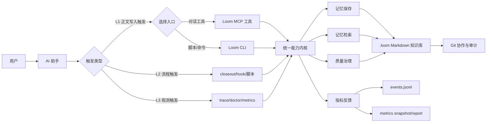
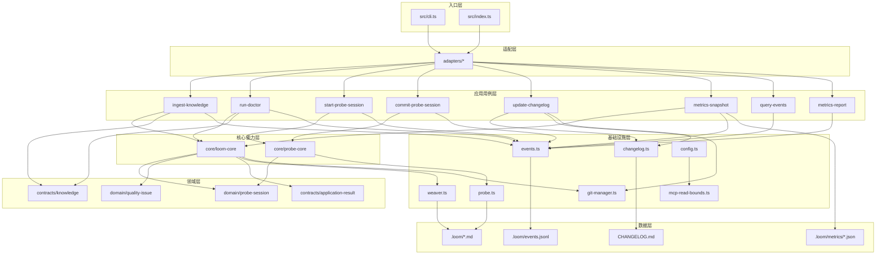
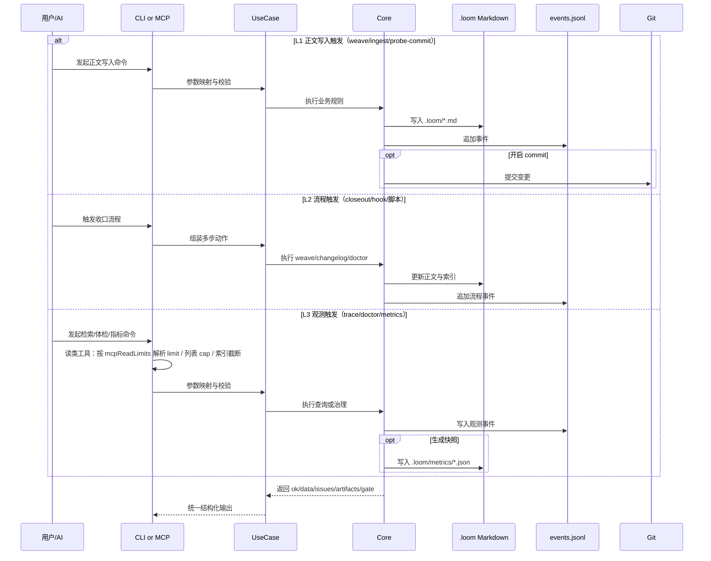
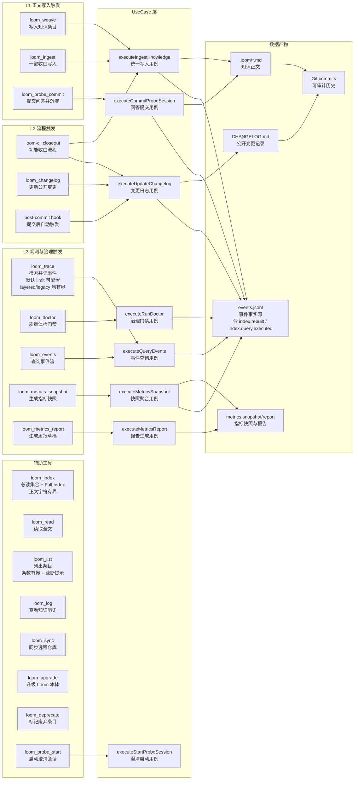

# Loom 技术架构图（全局总览）

本文给两层视图：

- 第一层：给非技术同学的“业务总览图”（先看整体怎么运转）
- 第二层：给技术同学的“工程细化图”（再看模块边界和数据流）

---

## 01. 业务总览图（非技术优先）

### 这张图怎么理解

- Loom 不依赖单一入口：聊天里可用 MCP，自动化里可用 CLI。
- 触发分三层：L1（正文写入）、L2（流程收口）、L3（观测记录）。
- 不管从哪里进，都会走同一个能力内核，保证行为一致。
- 记忆落在本地 Markdown（`.loom`），不是黑盒数据库。
- Git 提供版本历史与团队协作；事件与指标提供可量化反馈。

---

## 02. 工程细化图（技术实现）

**基础设施补充**：`config.ts` 提供 `mcpReadLimits`（及 `LOOM_MCP_*` 环境变量覆盖）；`mcp-read-bounds.ts` 提供列表截断与 Markdown 截断的纯函数。**MCP**（`index.ts`）与 **CLI**（`cli.ts`）在读类响应组装阶段共用上述配置与工具；`weaver.trace` 在调用方未传有效 `limit` 时仍应用与默认常量一致的结果条数上界，避免 legacy 全量返回。

---

## 03. 记忆触发时序（关键路径）

### 触发层定义（补充说明）

- **L1 正文写入触发**：把知识正文落到 `.loom/*.md`（核心记忆）。
- **L2 流程触发**：把“人记得做”变成“流程保证做”（closeout、hook、CI 脚本）。
- **L3 观测触发**：不一定写正文，但会记录事件/快照用于治理与复盘。
- **索引事件闭环**：每次索引重建与检索都会写入事件（`index.rebuilt` / `index.query.executed`），用于衡量索引新鲜度与可用性。
- **读路径返回有界**：`loom_list` / `loom_trace` / `loom_index`（Full Index 段）在**入口层**按配置做默认截断，与「渐进披露、控制单次 tool 体积」一致；细节见下节。

---

## 04. 架构硬核点（简版）

- **双入口同核**：CLI 与 MCP 共享同一用例/核心能力，避免逻辑分叉。
- **读路径默认有界**：`.loomrc.json` 的 `mcpReadLimits` + `LOOM_MCP_LIST_MAX_ENTRIES` / `LOOM_MCP_TRACE_DEFAULT_LIMIT` / `LOOM_MCP_INDEX_FULL_MAX_CHARS`；`mcp-read-bounds.ts` 与 `resolveTraceLimit` 保证 **CLI `list`/`trace` 与 MCP 同策略**，`weaver.trace` 对缺省 `limit` 的 layered/legacy 一致 capped。
- **可审计记忆**：Markdown + Git，天然支持 review、diff、回滚。
- **可治理闭环**：doctor + events + metrics snapshot/report，支持持续优化。
- **可扩展演进**：当前已具备 domain/usecase/contracts 分层，可平滑扩到 HTTP/Daemon。

### 04.1 配置项与代码锚点（读路径）

| 能力 | 默认语义（可配置） | 主要代码 |
|------|-------------------|----------|
| 列表概览 | 按 `updated` 新近优先，最多 `listMaxEntries` 条 | `applyListEntryCap`，MCP `loom_list` / CLI `list` |
| 检索 | 未传 `limit` 时使用 `traceDefaultLimit`（layered / legacy） | `resolveTraceLimit` + `weaver.trace` |
| 索引工具 | 「### Full Index」正文最多 `indexFullMaxChars` 字符 | `truncateMarkdownForContext`，MCP `loom_index` |

完整执行说明与验收见 `docs/执行计划/02-mcp-context-footprint-and-bounded-reads.md`；产品侧「宿主 vs Loom」责任划界见 `docs/待整理/PROMPTS.md` §3.1。

---

## 05. Tool 能力映射图（从工具看架构）

### 一句话看懂这张图

- 工具不是孤立能力：每个 tool 都映射到统一 usecase，再统一沉淀到 Markdown/事件/指标/Git 产物。

---

## 06. 相关文档

- **从模型视角理解「每轮上下文」与如何模拟 / 记录**：[大模型视角-上下文与可观测性.md](./大模型视角-上下文与可观测性.md)
- **OpenCode + Loom MCP 单轮对话演练沙箱**：[OpenCode-Loom-MCP-演练沙箱.md](./OpenCode-Loom-MCP-演练沙箱.md)（`npm run sandbox:opencode`）
- **OpenCode 侧请求上下文落盘（执行计划）**：[执行计划/03-opencode-context-request-logging.md](../执行计划/03-opencode-context-request-logging.md)
- **跨项目可复用：宿主 CLI + MCP 隔离沙箱 E2E 模式**：[跨项目可复用经验/README.md](../跨项目可复用经验/README.md)

---

## 07. 宿主集成 E2E 与可观测性（补充）

本仓库在 **单元测试（Vitest）** 之外，增加一层 **「真实宿主进程 + 真实 stdio MCP + 隔离工作目录」** 的脚本化 E2E，用于验证「模型是否实际调度 `loom_*`」与（可选）宿主侧 **上下文请求 JSONL** 是否落盘。该层 **不替代** `tests/*.test.ts`，而是覆盖集成与可观测性缺口。

| 能力 | 路径 / 命令 | 说明 |
| --- | --- | --- |
| 沙箱脚手架 | `scripts/opencode-loom-sandbox/setup.sh`、`npm run sandbox:opencode` | 生成独立目录、`opencode.json` 中声明 Loom MCP、`LOOM_WORK_DIR` 指向沙箱 |
| E2E Runner | `tests/e2e-opencode-sandbox/runner.mjs`、`npm run test:e2e-opencode` | 需环境变量 `OPENCODE_PACKAGE_DIR`（OpenCode `packages/opencode`）；子进程 **stdin ignore** 避免非交互阻塞 |
| 用例清单 | `tests/e2e-opencode-sandbox/cases.json` | 自然语言 prompt + stdout 子串断言（工具行前缀如 `loom_loom_index`） |
| 运行归档 | `tests/e2e-opencode-sandbox/results/run-*` | `manifest.json`、`SUMMARY.md`、逐用例输出副本、可选 `context-request-log/**/requests.jsonl` |
| 离线日志样例 | `scripts/reproduce-opencode-context-log-sample.sh`、`npm run demo:opencode-context-log` | 不调模型，验证与 OpenCode `fireContextRequestLog` 同形 JSONL |

**数据流（概念）**：临时沙箱目录 → 宿主读取项目级 `opencode.json` → 启动 Loom MCP（`node dist/index.js`）→ 宿主 `run` 一轮用户话 → Loom 读写沙箱内 `.loom`；断言依赖宿主合并输出与归档文件，而非伪造 MCP 响应。
