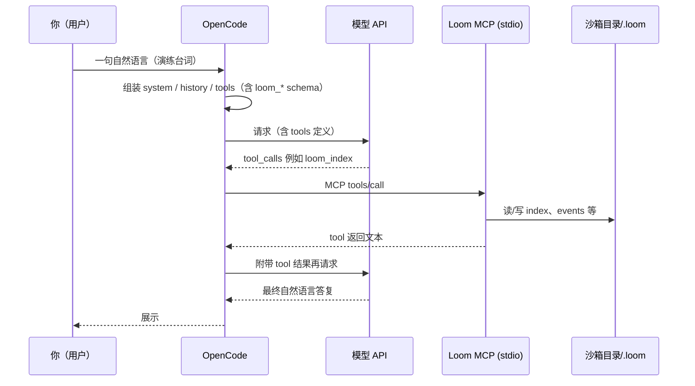

# OpenCode + Loom MCP：单轮对话演练沙箱（设计说明）

本文给出一套 **可复现的「最小真实环境」**：以 **OpenCode 为主产品宿主**（开源、可插桩），用 **本仓库构建出的 Loom** 当 **stdio MCP**，在 **隔离目录** 里跑 **哪怕一条** 用户指令，观察 **工具列表 → 模型决策 → `loom_*` 调用 → `.loom` 与日志** 的完整链路。行为以 **OpenCode 实际组装的消息 + 沙箱目录下的 `opencode.json`** 为准。

若要 **落盘每一轮完整 `messages`（宿主侧）**，见 [大模型视角-上下文与可观测性.md](./大模型视角-上下文与可观测性.md) §7.5（在 OpenCode 的 `LLM.stream` 里、`streamText` 前写 JSONL）。

---

## 1. 环境拓扑（一条对话里谁在干什么）



**「真实」的含义**：MCP 子进程是 **真实的 `node dist/index.js`**；`LOOM_WORK_DIR` 指向沙箱，**不会污染**你日常项目里的 `.loom`（除非你故意指过去）。

---

## 2. 前置条件

| 项 | 说明 |
|----|------|
| **本仓库已构建** | 在 Loom 根目录执行 `npm run build`，存在 `dist/index.js`。 |
| **OpenCode 可用** | 本机已能运行 OpenCode CLI（或你从 `/Users/ruska/开源项目/opencode` 本地 `bun`/`npm` 跑出来的二进制），且 **已配置好模型 Provider**（API Key 等通常走 OpenCode 全局配置，与沙箱目录无关）。 |
| **网络** | 调用云端模型时需要能访问对应 API。 |

### 2.1 源码版 OpenCode 与全局 CLI：要不要「复制配置」？

**一般不需要复制。** 全局安装的 `opencode` 与你在源码目录里用 `bun run --conditions=browser ./src/index.ts …` 跑出来的入口，只要 **同一用户、同一 `HOME`**，会读 **同一套 XDG 路径**（与安装方式无关）：

| 用途 | 典型路径（本机 macOS + 默认 XDG） |
|------|----------------------------------|
| 全局用户配置（`provider` / `model` / 插件列表等） | `~/.config/opencode/opencode.json`（或同目录下 `opencode.jsonc`、`config.json`） |
| 登录态与 API Key 等（`Auth` 落盘） | `~/.local/share/opencode/auth.json` |

OpenCode 的配置合并顺序见源码 `config.ts` 注释：**全局配置先加载，再被项目根目录的 `opencode.json` 覆盖**；沙箱里那份通常只写 `mcp.loom`，**不会替代**你在全局里配好的模型与 Key。

若你曾设过这些环境变量，才会和全局 CLI **不一致**（需自行对齐或取消）：`OPENCODE_TEST_HOME`、`XDG_CONFIG_HOME` / `XDG_DATA_HOME`、`OPENCODE_CONFIG`（单独指定配置文件）、`OPENCODE_DISABLE_PROJECT_CONFIG`、`OPENCODE_CONFIG_CONTENT` 等。

**可选做法（冗余但明确）**：跑源码前显式指定同一份文件，例如  
`OPENCODE_CONFIG="$HOME/.config/opencode/opencode.json"` —— 与默认行为等价，仅在你想临时切到「另一份全局配置」时有用。

---

## 3. 一键生成沙箱目录

在 **Loom 仓库根**执行：

```bash
npm run build
bash scripts/opencode-loom-sandbox/setup.sh
```

默认沙箱：`$HOME/loom-opencode-lab`。自定义路径：

```bash
bash scripts/opencode-loom-sandbox/setup.sh /path/to/my-lab
```

脚本会：

1. 写入 **`opencode.json`**（由脚本内嵌 Node 生成合法 JSON；**`mcp.loom`**：`type: local`，`command: ["node", "<本仓库绝对路径>/dist/index.js"]`，`environment.LOOM_WORK_DIR` = 沙箱根目录）。  
2. 写入沙箱内 **`.loomrc.json`**，默认打开 **`fullConversationLogging`**，便于在 `.loom/raw_conversations/` 看到 **Loom 侧 tool 入参/出参**（仍非 OpenCode 完整 prompt）。  
3. 在沙箱根执行 **`loom-cli init`**（通过 `LOOM_WORK_DIR` 指向沙箱），生成 **`.loom/`** 骨架。

---

## 4. 用 OpenCode 跑「一条对话」

1. **进入沙箱目录**（关键：`opencode.json` 在项目根，OpenCode 才会合并该文件的 `mcp`）：

   ```bash
   cd ~/loom-opencode-lab   # 或你的自定义路径
   ```

2. **启动 OpenCode**（命令以你本机安装为准，例如）：

   ```bash
   opencode
   ```

3. **选一个有工具调用能力的 Agent / 模式**（需能使用 MCP 工具；若 OpenCode 要求对 `loom_*` 授权，请 **允许**）。

4. **发送一条「演练台词」**（任选其一，中文即可）：

   - **只读索引（推荐首条）**：  
     `请调用 Loom 的 loom_index 工具（不要猜），把返回里「必读集合」用三句话中文概括。`  
   - **写入一条再读**：  
     `请先调用 loom_weave 写入一条 concepts，标题「沙箱演练」，正文一两句；再调用 loom_trace 用关键词「沙箱」检索并说明命中条数。`

5. **你应能观察到**：

   - OpenCode UI 中出现 **对 `loom_index` / `loom_weave` / `loom_trace` 的调用**（或等价展示）。  
   - 沙箱下 **`.loom/`** 出现或更新 **`index.md`**、`concepts/*.md` 等。  
   - 若未关日志：`.loom/raw_conversations/events-*.jsonl` 中有对应 tool 的 **input/output** 片段。

### 4.1 补充：用 `opencode run`「一条命令跑完」时的两个坑

1. **`-m` 是 `--model`（provider/model）**，不是用户消息。消息请用**位置参数**放在命令末尾，例如：  
   `…/src/index.ts run --dir /path/to/sandbox "请调用 loom_index …"`  
2. **非交互环境（脚本、部分 IDE 集成终端）里 `stdin` 往往不是 TTY**：OpenCode 的 `run` 会执行 `await Bun.stdin.text()` 等待标准输入结束。若上游没有把 stdin 关掉，进程会**一直卡在这里**（看起来像「超时 / 没反应」）。  
   **修法**：显式关掉 stdin，例如：  
   `… run --dir /path/to/sandbox "你好" < /dev/null`  
   在真实交互终端里直接跑则通常无此问题。

3. **自动化 E2E**：仓库内已提供脚本化用例（多轮 `loom_index` / `loom_init` / `loom_doctor` / `loom_weave` / `loom_trace` 等），见 [`tests/e2e-opencode-sandbox/README.md`](../../tests/e2e-opencode-sandbox/README.md)；入口：`npm run test:e2e-opencode`（需设置 `OPENCODE_PACKAGE_DIR`）。
4. **跨项目复用**：该沙箱 + E2E 脚本化的通用模式（清单、坑位、对照路径）已单独入档 [`docs/跨项目可复用经验/`](../跨项目可复用经验/README.md)。

---

## 5. 操作手册：对话一次后，去哪里看「模型这一轮吃到什么」（`requests.jsonl`）

> 依赖：OpenCode 已合并 **执行计划 03** 的改动（`LLM.stream` 在 `streamText` 前写日志）。若你仍用官方安装包且未换成本地编译版，**不会**生成下列文件。

### 5.1 启动前：准备日志目录与环境变量

1. 选一个**绝对路径**专门放日志（不要提交到 Git）：

   ```bash
   mkdir -p "$HOME/opencode-context-logs"
   ```

2. 在**同一个终端会话**里导出（**从该终端启动 OpenCode**，这样子进程才能继承变量）：

   ```bash
   export OPENCODE_CONTEXT_LOG_DIR="$HOME/opencode-context-logs"
   ```

   可选（按需）：

   ```bash
   # 单条消息/字段过长时总预算（字符级，默认约 20 万）
   export OPENCODE_CONTEXT_LOG_MAX_CHARS=200000
   # 是否在日志里附带各 tool 的 schema（体积大，默认不写）
   export OPENCODE_CONTEXT_LOG_TOOLS=full
   ```

3. **重要**：若你是点 Dock / 图形界面启动 OpenCode，**不一定**会带上上述环境变量。请改用 **终端里执行 `opencode`**（或你本机等价命令），或给 GUI 配好同样环境（因系统而异）。

### 5.2 用「已带环境变量」的终端进入沙箱并对话一次

```bash
cd ~/loom-opencode-lab   # 或你的沙箱路径
opencode                 # 或: bun run … 指向你本地编译的 opencode
```

在对话里发**一句**即可，例如：

`请调用 loom_index，把返回里「必读集合」用三句话中文概括。`

（模型每触发 **一次** 对底层 `LLM.stream` 的请求，通常会 **追加一行** JSONL；若还有第二轮带 tool 结果的请求，会 **多一行**。）

### 5.3 对话结束后：结果文件在哪、长什么样

1. 列出会话子目录（目录名由 **sessionID** 净化而来，非中文原文）：

   ```bash
   ls -la "$OPENCODE_CONTEXT_LOG_DIR"
   ```

2. 进入**最新或对应会话**的子目录，打开：

   ```text
   <OPENCODE_CONTEXT_LOG_DIR>/<会话子目录>/requests.jsonl
   ```

3. **每一行**是一条完整 JSON（一次 `streamText` 前的快照）。用下面任一方式查看：

   ```bash
   # 看最后一轮写了什么
   tail -n 1 "$OPENCODE_CONTEXT_LOG_DIR"/*/requests.jsonl | jq .

   # 或先找到具体文件再 pretty-print
   jq . "$OPENCODE_CONTEXT_LOG_DIR/某子目录/requests.jsonl"
   ```

4. 文件里重点字段：**`messages`**（本轮送进模型的消息列表）、**`tools`**（工具名与描述，默认不含完整 schema）、**`sampling`**、**`headers`**（敏感头已脱敏）。

### 5.4 想「变成一篇可读文档」时

- **最快**：把 `jq` 美化后的 JSON **复制**到笔记 / `docs/` 下某个 `.md`，用 markdown 代码块包起来。  
- **命令一键导出一份 Markdown 草稿**（示例）：

  ```bash
  OUT=~/opencode-context-logs/last-turn.md
  echo "# OpenCode 请求快照（$(date -Iseconds)）" > "$OUT"
  echo '```json' >> "$OUT"
  tail -n 1 "$OPENCODE_CONTEXT_LOG_DIR"/*/requests.jsonl | jq . >> "$OUT"
  echo '```' >> "$OUT"
  open "$OUT"   # 或 cursor / code 打开
  ```

### 5.5 离线一键生成「同格式」结果（不调 OpenCode UI）

本机已克隆 **带 03 改动的 OpenCode** 时，在 **Loom 仓库根**执行：

```bash
npm run demo:opencode-context-log
```

- 默认 OpenCode 路径：`$HOME/开源项目/opencode`，可通过 **`OPENCODE_ROOT=/path/to/opencode`** 覆盖。  
- 输出目录：`<loom>/.sandbox-output/opencode-context-log-sample/.../requests.jsonl`（git 忽略）。  
- 仓库内已提交 **格式化样例**（与上述结构一致）：[`samples/context-request-one-turn.sample.json`](./samples/context-request-one-turn.sample.json)。

### 5.6 和 Loom 自己的日志区别

| 文件 | 谁写的 | 内容 |
|------|--------|------|
| **`requests.jsonl`**（§5.3 / §5.5） | **OpenCode** | 接近「发给模型前」的 **messages + tools + 采样参数** |
| **`.loom/raw_conversations/events-*.jsonl`** | **Loom** | 仅 **Loom MCP 各 tool** 的 input/output 片段 |

两份可以同时开，互相对照。

---

## 6. 这算不算「模拟」？

| 层次 | 是否真实 |
|------|----------|
| **MCP 协议 + Loom 进程** | ✅ 真实 |
| **OpenCode 拼消息 + 调模型** | ✅ 真实（即你们日常主路径） |
| **与「另一 MCP 客户端」里同一句用户话是否逐字节一致** | ❌ 不保证（宿主实现不同） |

因此：这是 **「OpenCode + Loom」真实联调沙箱**，用于理解 **模型在你们主产品上如何通过 MCP 使用 Loom**；若换其它客户端，只需换对应 MCP 配置，Loom 行为仍由 `LOOM_WORK_DIR` 与 `.loomrc` 决定。

---

## 7. 常见问题

- **`loom` MCP 起不来**  
  - 检查 `opencode.json` 里 `node` 路径与 **`dist/index.js` 是否存在**（改过分支要先 `npm run build`）。  
  - 检查 **`LOOM_WORK_DIR`** 是否为沙箱根（脚本已写入 `environment`）。

- **模型从不调用工具**  
  - 换更强遵循指令的模型，或把台词写死为「必须调用工具 X」。  
  - 在 OpenCode 里确认 **MCP `loom` 已连接**、**权限未全局禁用 tool**。

- **想看「模型完整上下文」**  
  - **推荐按执行计划落地**：[执行计划/03-opencode-context-request-logging.md](../执行计划/03-opencode-context-request-logging.md)（OpenCode fork 分支、`OPENCODE_CONTEXT_LOG_DIR` 等）；背景与挂载点见 [大模型视角-上下文与可观测性.md](./大模型视角-上下文与可观测性.md) §7.5。  
  - 另可选自写最小 Harness：执行计划 [`01`](../执行计划/01-prompt-sandbox-llm-eval-harness.md)。

---

## 8. 相关文档

- [大模型视角-上下文与可观测性.md](./大模型视角-上下文与可观测性.md)  
- [ARCHITECTURE.md](./ARCHITECTURE.md)  
- [执行计划/03-opencode-context-request-logging.md](../执行计划/03-opencode-context-request-logging.md)（OpenCode 侧请求落盘）  
- [执行计划/01-prompt-sandbox-llm-eval-harness.md](../执行计划/01-prompt-sandbox-llm-eval-harness.md)  
