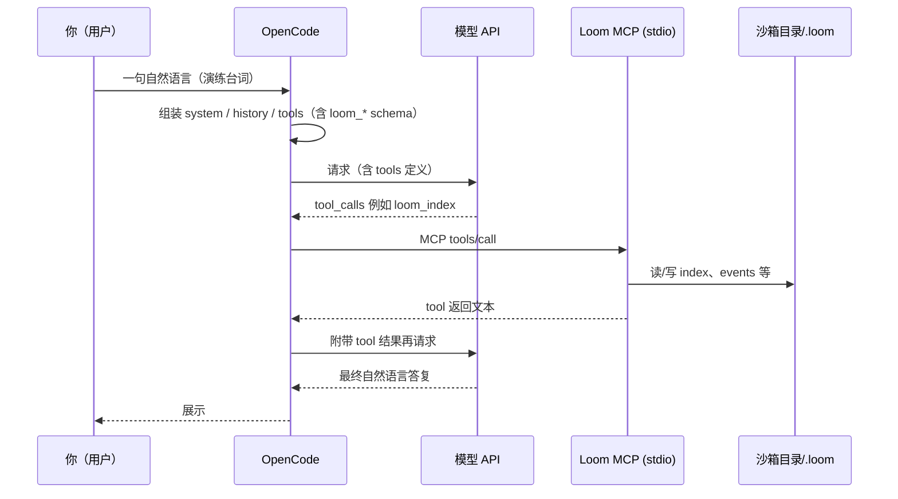

# OpenCode + Loom MCP：单轮对话演练沙箱（设计说明）

本文给出一套 **可复现的「最小真实环境」**：以 **OpenCode 为主产品宿主**（开源、可插桩），用 **本仓库构建出的 Loom** 当 **stdio MCP**，在 **隔离目录** 里跑 **哪怕一条** 用户指令，观察 **工具列表 → 模型决策 → `loom_*` 调用 → `.loom` 与日志** 的完整链路。行为以 **OpenCode 实际组装的消息 + 沙箱目录下的 `opencode.json`** 为准。

若要 **落盘每一轮完整 `messages`（宿主侧）**，见 [大模型视角-上下文与可观测性.md](./大模型视角-上下文与可观测性.md) §7.5（在 OpenCode 的 `LLM.stream` 里、`streamText` 前写 JSONL）。

---

## 1. 环境拓扑（一条对话里谁在干什么）



**「真实」的含义**：MCP 子进程是 **真实的 `node dist/index.js`**；`LOOM_WORK_DIR` 指向沙箱，**不会污染**你日常项目里的 `.loom`（除非你故意指过去）。

---

## 2. 前置条件

| 项 | 说明 |
|----|------|
| **本仓库已构建** | 在 Loom 根目录执行 `npm run build`，存在 `dist/index.js`。 |
| **OpenCode 可用** | 本机已能运行 OpenCode CLI（或你从 `/Users/ruska/开源项目/opencode` 本地 `bun`/`npm` 跑出来的二进制），且 **已配置好模型 Provider**（API Key 等通常走 OpenCode 全局配置，与沙箱目录无关）。 |
| **网络** | 调用云端模型时需要能访问对应 API。 |

---

## 3. 一键生成沙箱目录

在 **Loom 仓库根**执行：

```bash
npm run build
bash scripts/opencode-loom-sandbox/setup.sh
```

默认沙箱：`$HOME/loom-opencode-lab`。自定义路径：

```bash
bash scripts/opencode-loom-sandbox/setup.sh /path/to/my-lab
```

脚本会：

1. 写入 **`opencode.json`**（由脚本内嵌 Node 生成合法 JSON；**`mcp.loom`**：`type: local`，`command: ["node", "<本仓库绝对路径>/dist/index.js"]`，`environment.LOOM_WORK_DIR` = 沙箱根目录）。  
2. 写入沙箱内 **`.loomrc.json`**，默认打开 **`fullConversationLogging`**，便于在 `.loom/raw_conversations/` 看到 **Loom 侧 tool 入参/出参**（仍非 OpenCode 完整 prompt）。  
3. 在沙箱根执行 **`loom-cli init`**（通过 `LOOM_WORK_DIR` 指向沙箱），生成 **`.loom/`** 骨架。

---

## 4. 用 OpenCode 跑「一条对话」

1. **进入沙箱目录**（关键：`opencode.json` 在项目根，OpenCode 才会合并该文件的 `mcp`）：

   ```bash
   cd ~/loom-opencode-lab   # 或你的自定义路径
   ```

2. **启动 OpenCode**（命令以你本机安装为准，例如）：

   ```bash
   opencode
   ```

3. **选一个有工具调用能力的 Agent / 模式**（需能使用 MCP 工具；若 OpenCode 要求对 `loom_*` 授权，请 **允许**）。

4. **发送一条「演练台词」**（任选其一，中文即可）：

   - **只读索引（推荐首条）**：  
     `请调用 Loom 的 loom_index 工具（不要猜），把返回里「必读集合」用三句话中文概括。`  
   - **写入一条再读**：  
     `请先调用 loom_weave 写入一条 concepts，标题「沙箱演练」，正文一两句；再调用 loom_trace 用关键词「沙箱」检索并说明命中条数。`

5. **你应能观察到**：

   - OpenCode UI 中出现 **对 `loom_index` / `loom_weave` / `loom_trace` 的调用**（或等价展示）。  
   - 沙箱下 **`.loom/`** 出现或更新 **`index.md`**、`concepts/*.md` 等。  
   - 若未关日志：`.loom/raw_conversations/events-*.jsonl` 中有对应 tool 的 **input/output** 片段。

---

## 5. 这算不算「模拟」？

| 层次 | 是否真实 |
|------|----------|
| **MCP 协议 + Loom 进程** | ✅ 真实 |
| **OpenCode 拼消息 + 调模型** | ✅ 真实（即你们日常主路径） |
| **与「另一 MCP 客户端」里同一句用户话是否逐字节一致** | ❌ 不保证（宿主实现不同） |

因此：这是 **「OpenCode + Loom」真实联调沙箱**，用于理解 **模型在你们主产品上如何通过 MCP 使用 Loom**；若换其它客户端，只需换对应 MCP 配置，Loom 行为仍由 `LOOM_WORK_DIR` 与 `.loomrc` 决定。

---

## 6. 常见问题

- **`loom` MCP 起不来**  
  - 检查 `opencode.json` 里 `node` 路径与 **`dist/index.js` 是否存在**（改过分支要先 `npm run build`）。  
  - 检查 **`LOOM_WORK_DIR`** 是否为沙箱根（脚本已写入 `environment`）。

- **模型从不调用工具**  
  - 换更强遵循指令的模型，或把台词写死为「必须调用工具 X」。  
  - 在 OpenCode 里确认 **MCP `loom` 已连接**、**权限未全局禁用 tool**。

- **想看「模型完整上下文」**  
  - **推荐按执行计划落地**：[执行计划/03-opencode-context-request-logging.md](../执行计划/03-opencode-context-request-logging.md)（OpenCode fork 分支、`OPENCODE_CONTEXT_LOG_DIR` 等）；背景与挂载点见 [大模型视角-上下文与可观测性.md](./大模型视角-上下文与可观测性.md) §7.5。  
  - 另可选自写最小 Harness：执行计划 [`01`](../执行计划/01-prompt-sandbox-llm-eval-harness.md)。

---

## 7. 相关文档

- [大模型视角-上下文与可观测性.md](./大模型视角-上下文与可观测性.md)  
- [ARCHITECTURE.md](./ARCHITECTURE.md)  
- [执行计划/03-opencode-context-request-logging.md](../执行计划/03-opencode-context-request-logging.md)（OpenCode 侧请求落盘）  
- [执行计划/01-prompt-sandbox-llm-eval-harness.md](../执行计划/01-prompt-sandbox-llm-eval-harness.md)  
