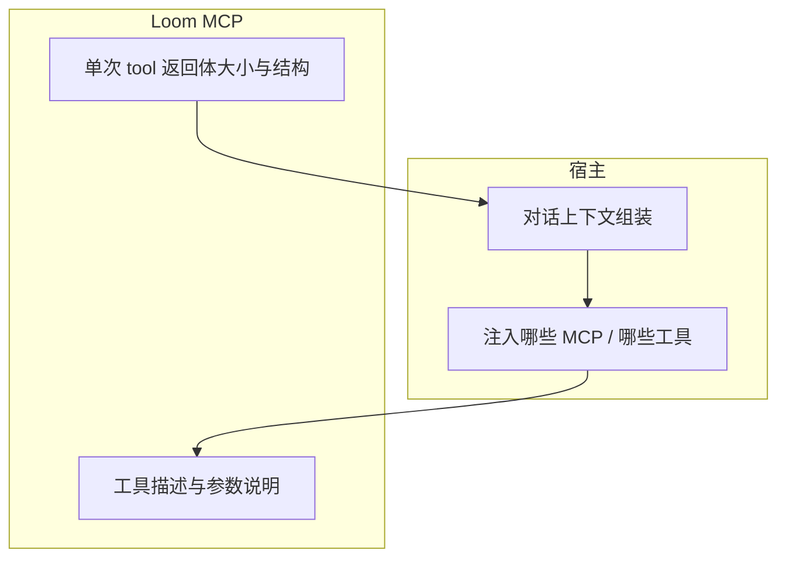

# 02：MCP 对对话上下文的污染与 Token 成本（计划草稿）

| 字段 | 值 |
|------|-----|
| 状态 | 草案 |
| 创建 | 2026-03-20 |
| 负责人 / 协作方 | （可选） |
| 关联文档 | [`调研/上下文工程-核心观点与对Loom的启发.md`](../调研/上下文工程-核心观点与对Loom的启发.md)、[`待整理/PROMPTS.md`](../待整理/PROMPTS.md)、[`执行计划/01-prompt-sandbox-llm-eval-harness.md`](../执行计划/01-prompt-sandbox-llm-eval-harness.md)、[`执行计划/02-mcp-context-footprint-and-bounded-reads.md`](../执行计划/02-mcp-context-footprint-and-bounded-reads.md)（**执行拆解**）、[`计划草稿/下一阶段-优化意向-草稿.md`](./下一阶段-优化意向-草稿.md) |

**存放**：`docs/计划草稿/`（与「下一阶段意向」同级）；执行勾选与验收以 **`执行计划/02`** 为准。

---

## 1. 背景与动机（为何现在写这个 plan）

### 1.1 产品 / 技术上下文

Loom 以 **MCP** 把多条工具与 `loom-instructions` 暴露给宿主里的模型。宿主（Cursor、OpenCode 等）通常会把 **工具列表（含名称、描述、参数 schema）** 放进模型可见的上下文；每次 **工具调用结果** 也会以消息形式追加。这与 [Harness/ACI 调研](../调研/上下文工程-核心观点与对Loom的启发.md) 中的判断一致：**上下文是稀缺资源**，无关或过大的结构化信息会与「正常对话」抢注意力，并带来 **Token 账单**。

### 1.2 已暴露的问题或机会

1. **工具面污染**：连接 MCP 后，即使用户只在闲聊，模型上下文中也可能长期带着 **十几～数十个工具的完整说明**，体积可观。  
2. **结果面污染**：一次 `loom_trace` / `loom_list` / 误用的宽查询若返回大块文本，会 **一次性占满工作窗口**，后续轮次推理质量下降。  
3. **感受与事实部分重叠**：用户直觉「MCP 很容易污染对话」**成立的一半**在 Loom 可控（返回体、默认值、文案长度）；另一半在 **宿主**（是否每次带全量 tools、是否压缩历史、是否按需启用 MCP）。  
4. **与磁盘日志的区分**：`.loom/raw_conversations` 等是 **落盘**，不自动等于「进模型上下文」；本 plan 聚焦 **模型可见上下文 + Token**。

### 1.3 本 plan 要解决的一句话

**在 Loom 可控范围内，降低 MCP 对宿主对话上下文的无效占用与 Token 浪费，并明确与宿主侧责任的边界。**

### 1.4 边界（非目标，刻意不做）

* 不承诺替 **所有宿主** 实现「按需加载子集 MCP 工具」（协议与产品各异）。  
* 不把「省 Token」建立在 **隐瞒关键契约** 上（例如删掉必要参数说明导致错误调用，总成本反升）。  
* 首版不以「砍掉半数工具」为默认手段（可用 **可选精简包** 作为进阶能力单独设计）。

---

## 2. 目标与非目标

### 2.1 目标

| ID | 目标 | 说明 |
|----|------|------|
| T1 | **有界默认** | 读类工具默认返回 **条数/字符上限** + **截断提示**，避免无意拖入整库。 |
| T2 | **渐进仍成立** | 保持 `index → trace → read` 哲学，但每层 **默认更轻**；全量在显式参数或二次调用中取得。 |
| T3 | **文案可瘦身** | `prompts/` 支持 **精简 tier**（或 `v-lite`）时，工具 description 更短，仍保留安全底线。 |
| T4 | **可观测** | 在事件或可选指标中记录 **单次 tool 返回体大小**（或分级 bucket），便于复盘「谁最吃 Token」。 |
| T5 | **文档说清** | 在 `PROMPTS.md` / README 中写明：**哪些成本是 Loom 管的，哪些是宿主管的**。 |

### 2.2 非目标

* 统一各厂商宿主的上下文压缩策略。  
* 替用户选择「只开 3 个工具」的 UI（可由宿主或用户规则完成）。  
* 将 Token 优化建立在违反 MCP 规范的行为上。

---

## 3. 方案概要

### 3.1 责任分层（简图）

* **宿主**：是否全量工具常驻、是否多 MCP 叠加、历史裁剪策略——往往占大头。  
* **Loom**：单工具 **描述长度**、**默认返回粒度与上限**、错误信息是否冗长——我们应持续优化。

### 3.2 关键取舍

* **默认保守（小）**：宁可多一次 `loom_read`，也不要默认 `trace` 带半本书。  
* **可配置**：`.loomrc` 或 env 允许「开发模式放宽上限」，与生产/评测场景区分。  
* **与提示词一致**：`loom-instructions` 应强调「先小后大」，与工具默认值同向，避免文案鼓励大查询而实现却截断（或相反）。

---

## 4. 落地执行计划（草案级 checkbox）

### 阶段 0：盘点与基线

**依赖**：无。

- [ ] 列出各 MCP 工具 **典型返回上界**（代码路径 + 现有 `limit` / 截断逻辑）。  
- [ ] 统计当前 `prompts/zh/v1/tools/*.md` **单工具说明**大致 token 量级（抽样即可）。  
- [ ] 在 `待整理/PROMPTS.md` 增加一小节：**上下文与 Token：Loom vs 宿主**。

### 阶段 1：读路径默认有界

**依赖**：阶段 0。

- [ ] `loom_trace` / `loom_index` / `loom_list`（若适用）统一审视：**默认 limit、截断文案、引导下一步**。  
- [ ] 对「易大块」工具增加 **硬上限或分页约定**（若 MCP 层可表达下一页；否则明确「请缩小查询」）。  
- [ ] 单测或契约测试：**默认参数下返回体不超过某阈值**（阈值可配置）。

### 阶段 2：提示词精简 tier（可选）

**依赖**：阶段 1。

- [ ] 约定 `prompts/zh/v1-lite/` 或 `manifest` 中 **lite 变体**（与 `promptVersion` 体系兼容）。  
- [ ] 短描述原则：保留 **安全与必填语义**，删举例与重复修辞。  
- [ ] 在 README 说明：**高工具数场景可切 lite**。

### 阶段 3：观测与复盘

**依赖**：阶段 1。

- [ ] 事件或 debug 通道记录 **tool 名 + 返回字节数档位**（注意勿默认记录全文以免磁盘爆）。  
- [ ] 与 [`执行计划/01`](../执行计划/01-prompt-sandbox-llm-eval-harness.md) 衔接：评测 run 可对比 **lite vs 全量** 的调用与体积。

---

## 5. 待与用户澄清的问题与建议

**优先级档位**同 [`执行计划/00`](../执行计划/00-meta-plan-writing-convention.md) §4.5。

| ID | 优先级 | 问题 / 待澄清点 | 若不澄清会影响什么 | 建议（可选） |
|----|--------|-------------------|--------------------|--------------|
| Q1 | P1 | **默认上限**偏保守还是偏宽松？（开发者抱怨要多点一次 vs 用户抱怨卡上下文） | 产品口碑两极、难以同时满足 | 分 `profile`：`default` / `devVerbose`；或仅 env 覆盖 |
| Q2 | P2 | 是否要做 **`v-lite` 提示词目录** 与 **v1 并行**，还是同一目录内 frontmatter 切换？ | 维护成本与加载逻辑复杂度 | 先 env + 文档；目录拆分放到 lite 文案稳定后 |
| Q3 | P2 | **错误信息**缩短到什么程度仍算「可行动」？ | 过短则多轮试错，Token 反增 | 保留 `issues[].suggestion` 一行 + 链接到 docs |

---

## 6. 数据、安全与合规

* 若记录返回体大小，避免把 **用户隐私内容** 写入事件明文；仅 metadata。  
* 精简 description 时注意不要删掉 **安全相关约束**（如脱敏、路径范围）。

---

## 7. 风险与缓解

| 风险 | 缓解 |
|------|------|
| 截断过猛，模型反复调用 | 返回中明确「已截断 + 如何缩小查询 / 用 read」 |
| lite 提示词导致误用工具 | 契约测试 + 与全量版对比冒烟 |
| 与宿主行为叠加难归因 | 文档写明分层 + 评测 harness 固定宿主配置 |

---

## 8. 验收标准（草案）

1. 至少 **2 个** 读类工具在默认参数下具备 **文档化上限** + **可测的契约或单测**。  
2. `待整理/PROMPTS.md`（或等价）中有 **「Token / 上下文」** 说明段落。  
3. （可选）存在 **lite** 提示词路径或明确「暂不做的」结论记入修订记录。

---

## 9. 后续演进

* 与宿主协作：**MCP Resources vs Tools** 分工（静态索引用 resource，减少 tools 描述重复）——依赖协议与宿主能力。  
* 工具分组 / namespace：需 MCP 生态进展再评估。

---

## 10. 修订记录

| 日期 | 说明 |
|------|------|
| 2026-03-20 | 初稿：污染来源、分层责任、分阶段任务与澄清项。 |
